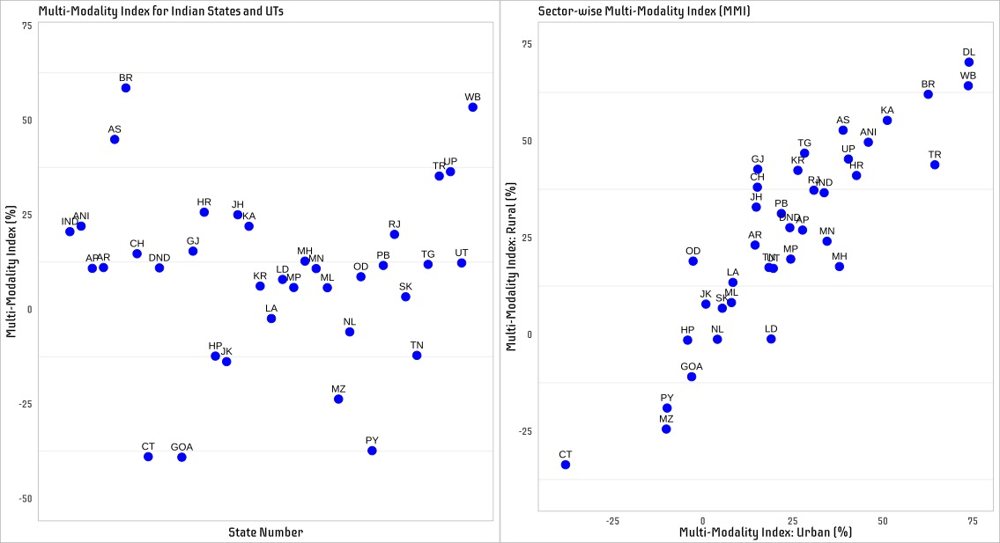
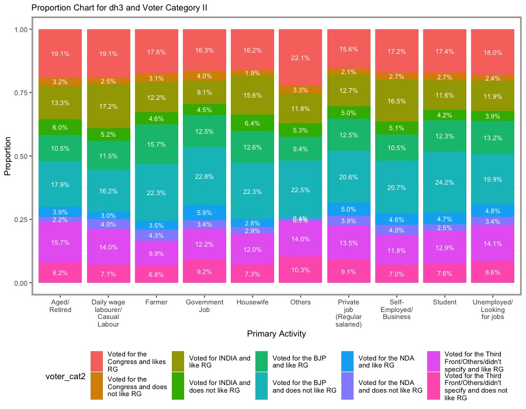
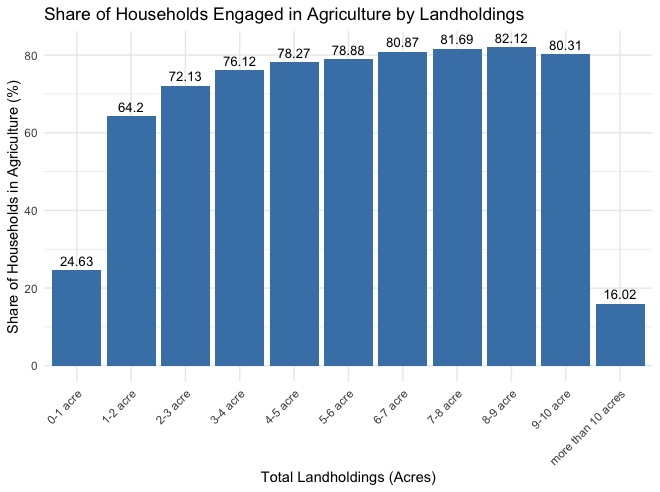
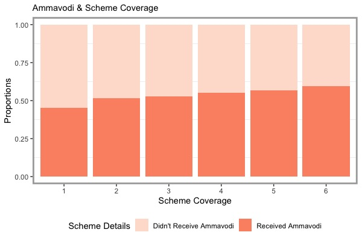

# Gurkirat Singh {.tabset}

## Biography  

    

  

    <a href="https://x.com/GreenGurkirat" target="_blank">Twitter</a> |
    <a href="https://github.com/gurkirat981" target="_blank">GitHub</a> |
    <a href="https://www.linkedin.com/in/gurkiratsingh08/" target="_blank">LinkedIn</a>

  

Hello! I am a researcher and public policy practitioner, currently employed at the Centre for Policy Research, New Delhi. My role primarily revolves around understanding performance management in public sector organizations, and addressing challenges surrounding social protection and public service delivery in India. Prior to this, I was a consultant with the Department of Information Technology, Government of Telangana.  

 A separate segment of my work also focuses on vehicular pollution and issues concerning sustainable mobility, particularly in urban parts of India. Recently, I co-authored a policy note as part of the ORF-GP series and proposed a framework to integrate informal transport modes like auto rickshaws and e-rickshaws under a unified fare pricing system. I am keen on exploring opportunities at the intersection of sustainability, climate policy and environmental governance.  

My background is in statistics and quantitative methods, with much of my work centered around the extensive use of surveys and administrative datasets. I was trained in Economics at the University of Delhi, and was subsequently awarded the Young India Fellowship by Ashoka University, with full tuition support from the HDFC Bank.  

---

## Publications  

### Reports & Policy Briefs  
  
**Singh, G., Karia, S. (2021).** Training programmes conducted for trainee officers of the Meghalaya Civil Services. *Centre for Policy Research*. 

**Sharma, R., Singh, G., Kochhar, R. (2023).** Study of Village and Ward Secretariats in Andhra Pradesh: Impact & Strengthening. *Centre for Policy Research*.   

**Singh, G.** Study of Village and Ward Secretariats: Recommendations & Key Actions Points. *Centre for Policy Research*.  

**Singh G. (2023).** Locating Upward Mobility in Andhra Pradesh Households: Findings from the Andhra Pradesh Urban Youth Survey. *Centre for Policy Research*. 

**Singh, G. (2023).** Perceptions, Government Support & Access to Cash Transfer Schemes: Findings from the Andhra Pradesh Urban Youth Survey. *Centre for Policy Research*.  

### Working Papers  
  
**Mukhopadhyay P., Singh G. (2024).** Integration of Fares, Information, and Informal Transit. *ORF-Global Policy (GP) Series Journal*, Pg. 122-133.  

---

## Data Visualisations  

<b>An illustrative respository of my data visualisations from surveys and publicly available administrative datasets.</b>

<table align="center" style="border-spacing: 15px; padding: 20px;">
    <tr>
        <td></td>
        <td></td>
        <td></td>
    </tr>
    <tr>
        <td></td>
        <td></td>
        <td></td>
    </tr>
    <tr>
        <td></td>
        <td></td>
        <td></td>
    </tr>
    <tr>
        <td></td>
        <td></td>
        <td></td>
    </tr>
</table>