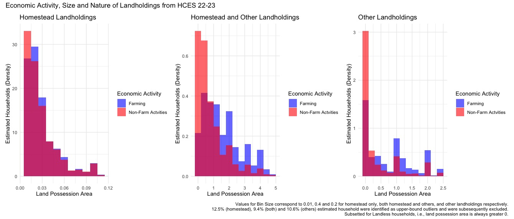
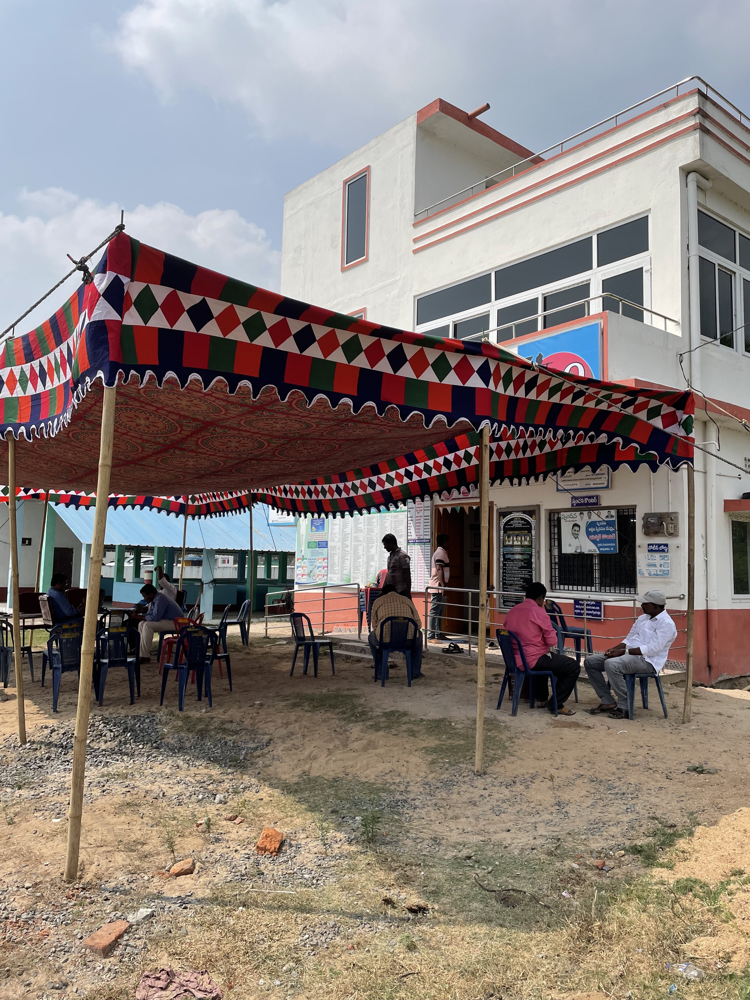
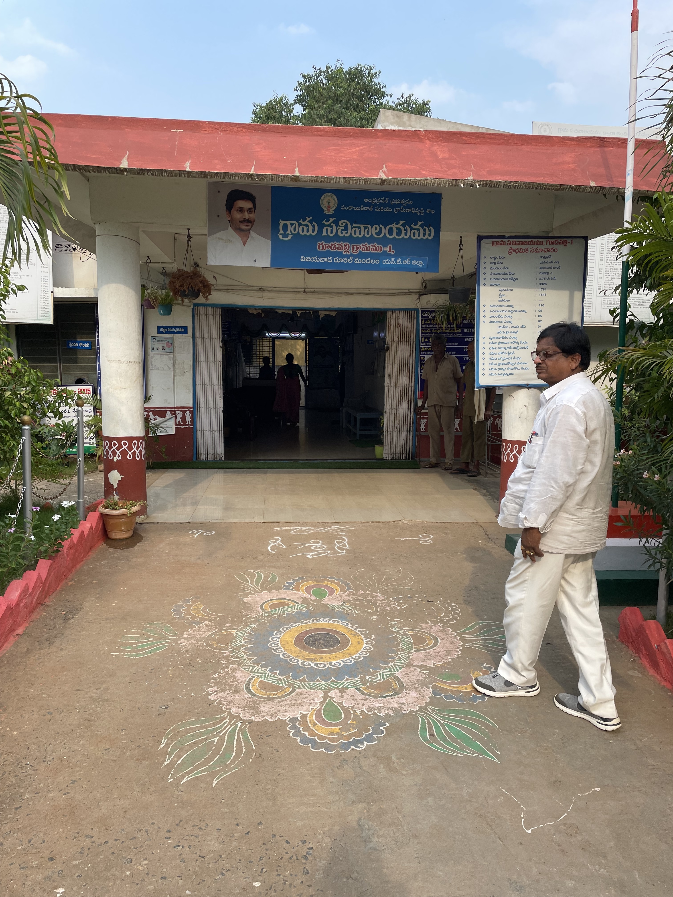

<!-- Add viewport meta tag for mobile responsiveness -->
<meta name="viewport" content="width=device-width, initial-scale=1">

# Gurkirat Singh {.tabset}

## About Me  

    

  

    
    &nbsp; | &nbsp;
    
    &nbsp; | &nbsp;
    

Hello! I am a researcher and public policy practitioner, currently employed at the Centre for Policy Research, New Delhi. My role primarily revolves around understanding performance management in public sector organizations, and addressing challenges surrounding social protection and public service delivery in India. Prior to this, I was a consultant at the Department of Information Technology, Government of Telangana.

A separate segment of my work also focuses on vehicular pollution and issues concerning sustainable mobility, particularly in urban parts of India. Recently, I co-authored a policy note as part of the ORF-GP series and proposed a framework to integrate informal transport modes like auto rickshaws and e-rickshaws under a unified fare pricing system. I am keen on exploring opportunities at the intersection of sustainability, urban policy and environmental governance.

My background is in statistics and quantitative methods, with much of my work centered around the extensive use of surveys and administrative datasets. I majored in Economics at the University of Delhi, and was subsequently awarded the Young India Fellowship by Ashoka University, with full tuition support from the HDFC Bank.

## Publications  

### Reports & Policy Briefs  
  
**Singh, G., Karia, S. (2021).** Training programmes conducted for trainee officers of the Meghalaya Civil Services. *Centre for Policy Research*. 

**Sharma, R., Singh, G., Kochhar, R. (2023).** Study of Village and Ward Secretariats in Andhra Pradesh: Impact & Strengthening. *Centre for Policy Research*.   

**Singh, G.** Study of Village and Ward Secretariats: Recommendations & Key Actions Points. *Centre for Policy Research*.  

**Singh, G. (2023).** Locating Upward Mobility in Andhra Pradesh Households: Findings from the Andhra Pradesh Urban Youth Survey. *Centre for Policy Research*. 

**Singh, G. (2023).** Perceptions, Government Support & Access to Cash Transfer Schemes: Findings from the Andhra Pradesh Urban Youth Survey. *Centre for Policy Research*.  

### Working Papers  
  
**Mukhopadhyay P., Singh G. (2024).** Integration of Fares, Information, and Informal Transit. *ORF-Global Policy (GP) Series Journal*, Pg. 122-133.  

## Data Visualisations  

<b>An illustrative repository of my data visualisations from surveys and publicly available administrative datasets.</b>

<!-- Add Lightbox2 CSS -->
<link href="https://cdnjs.cloudflare.com/ajax/libs/lightbox2/2.11.3/css/lightbox.min.css" rel="stylesheet">

<!-- Add custom CSS for responsive table -->

<table class="responsive-table" align="center">
    <tr>
        <td></td>
        <td></td>
        <td></td>
    </tr>
    <tr>
        <td></td>
        <td></td>
        <td></td>
    </tr>
    <tr>
        <td></td>
        <td></td>
        <td></td>
    </tr>
    <tr>
        <td></td>
        <td></td>
        <td></td>
    </tr>
</table>

<!-- Add Lightbox2 JavaScript -->

## Field Work  

<b>Some archives from my fieldwork in Machilipatnam, Vijayawada, and Araku Valley (Andhra Pradesh, India).</b>

<!-- Add Lightbox2 CSS -->
<link href="https://cdnjs.cloudflare.com/ajax/libs/lightbox2/2.11.3/css/lightbox.min.css" rel="stylesheet">

<!-- Add custom CSS for responsive table -->

<table class="responsive-table" align="center">
    <tr>
        <td></td>
        <td></td>
        <td></td>
    </tr>
    <tr>
        <td></td>
        <td></td>
        <td></td>
    </tr>
    <tr>
        <td></td>
        <td></td>
        <td></td>
    </tr>
    <tr>
        <td></td>
        <td></td>
        <td></td>
    </tr>
</table>

<!-- Add Lightbox2 JavaScript -->

## Blog  

<!-- Add Lightbox2 CSS (if needed for thumbnails) -->
<link href="https://cdnjs.cloudflare.com/ajax/libs/lightbox2/2.11.3/css/lightbox.min.css" rel="stylesheet">

<!-- Add custom CSS for the grid layout -->

<table class="articles-table">
    <tr>
        <!-- Article 1 -->
        <td>
            
            <h3>Popular Transportation and Fare Integration</h3>
            
A review of the state of informal transportation and fare integration frameworks across selected cities

            <a href="https://medium.com/@itsgurkirat/popular-transportation-and-fare-integration-a-review-of-global-practices-71ac64fdae24" target="_blank">Read More</a>
            <table class="author-date-table">
                <tr>
                    <td></td>
                    <td>03/2025</td>
                </tr>
            </table>
        </td>
        <!-- Article 2 -->
        <td>
            
            <h3>On Survey Logistics & Enumeration</h3>
            
Insights from the CPR-AP Urban Youth Survey

            <a href="https://medium.com/@itsgurkirat/surveys-enumeration-insights-from-the-cpr-ap-urban-youth-survey-6db6e9452422" target="_blank">Read More</a>
            <table class="author-date-table">
                <tr>
                    <td></td>
                    <td>03/2025</td>
                </tr>
            </table>
        </td>
        <!-- Article 3 -->
        <td>
            
            <h3>Prevailing Citizen Perceptions on Centrally-Sponsored Schemes</h3>
            
Findings from the DALES-IES Survey

            <a href="https://medium.com/@itsgurkirat/attribution-for-centrally-sponsored-benefits-fd3cb2e0d272" target="_blank">Read More</a>
            <table class="author-date-table">
                <tr>
                    <td></td>
                    <td>03/2025</td>
                </tr>
            </table>
        </td>
    </tr>
</table>

<!-- Add Lightbox2 JavaScript (if needed) -->

## Resume and Contact

You can view my resume <a href="resume.pdf" target="_blank">here.</a> 

I can be reached out at gurkirat@cprindia.org or gurkiratsingh.sggscc@gmail.com. Thank you for visiting my website!

